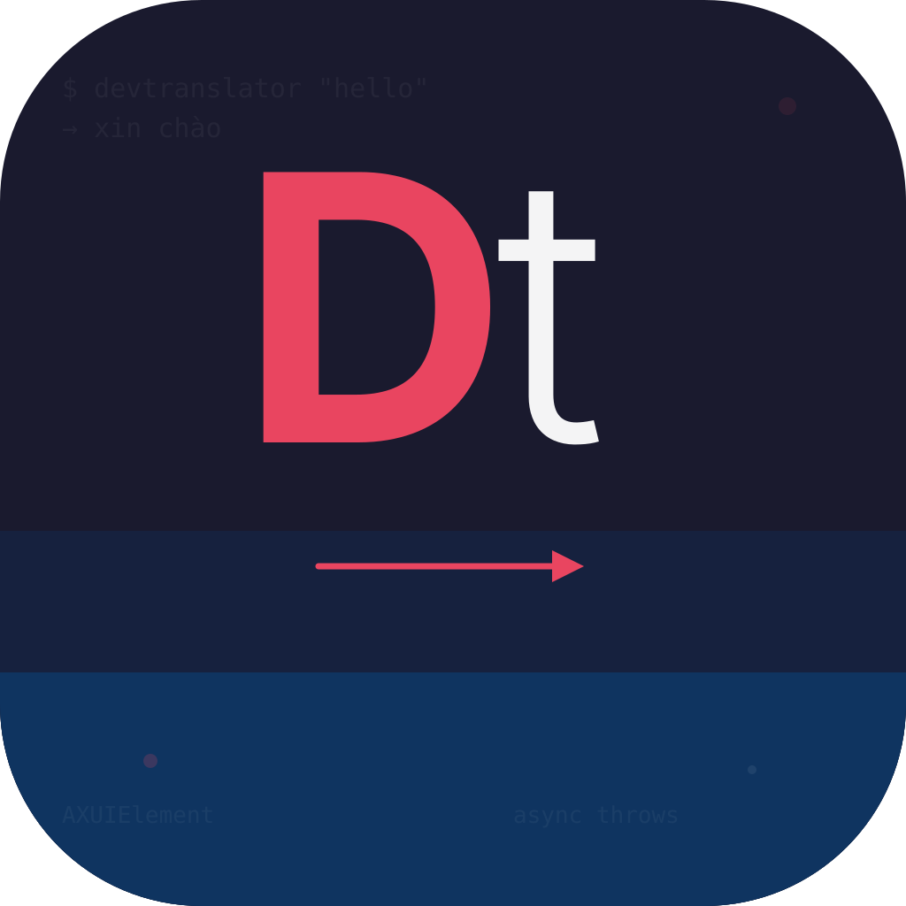

<p align="center">
  
</p>

<h1 align="center">DevTranslator</h1>

<p align="center">
  <strong>Instant translation for developers who live in the terminal.</strong><br/>
  Select text → click → translated. No context switching.
</p>

<p align="center">
  <a href="#install-in-10-seconds">Install</a> •
  <a href="#how-it-works">How it Works</a> •
  <a href="#features">Features</a> •
  <a href="#configuration">Configuration</a> •
  <a href="#supported-terminals">Supported Terminals</a> •
  <a href="#building-from-source">Build from Source</a> •
  <a href="#contributing">Contributing</a>
</p>

<p align="center">
  
  
  
  <!--  -->
</p>

<!-- TODO: Add GIF demo here -->
<!-- <p align="center"></p> -->

---

## The Problem

You're deep in a Claude Code session. An error message appears. A Stack Overflow answer is half in English, half jargon you need to look up. You copy the text, open a browser tab, paste it into Google Translate, read the result, switch back to the terminal. Flow broken.

DevTranslator fixes this. Highlight any text in your terminal, click the floating icon, and the translation appears right there. No tab switching, no copy-paste, no interruption.

Built for non-native English developers working with agent coding tools, terminal-heavy workflows, and CLI environments.

---

## Install in 10 Seconds

```bash
curl -fsSL https://raw.githubusercontent.com/delee03/DevTranslator/main/install.sh | sh
```

That's it. The script will:
- Detect your Mac's architecture (Apple Silicon or Intel)
- Download the correct binary
- Add it to your PATH
- Prompt for macOS Accessibility permission (required for text selection detection)

To uninstall:

```bash
curl -fsSL https://raw.githubusercontent.com/delee03/DevTranslator/main/install.sh | sh -s -- --uninstall
```

---

## How it Works

```
 ① Select text in any terminal
 ┌─────────────────────────────────────────┐
 │ $ Error: Cannot find module 'express'   │
 │          ~~~~~~~~~~~~~~~~~~~~~~~~ ← You │
 │                                  select │
 │                              [Dt]  ← ② Icon appears
 └─────────────────────────────────────────┘

 ③ Click the icon → translation popup
 ┌──────────────────────────────────────┐
 │ Lỗi: Không tìm thấy module          │
 │ 'express'                            │
 │                             [Copy]   │
 └──────────────────────────────────────┘
```

1. **Select** — Highlight any text in your terminal
2. **Click** — A small `Dt` icon appears near your selection
3. **Read** — Translation popup shows the result in your language

You can also use the keyboard shortcut `Cmd+Shift+T` instead of clicking.

---

## Features

**Translation popup** — Select text anywhere in your terminal, get an instant translation popup. Default target language is Vietnamese, configurable to 100+ languages.

**CLI translate** — Use it directly from the command line without the GUI:

```bash
# Translate text
devtranslator "Build failed: missing dependency"
# → Xây dựng không thành công: thiếu phụ thuộc

# Pipe support
echo "Permission denied" | devtranslator

# Translate to a different language
devtranslator --lang ja "Good morning"
# → おはよう
```

**Background daemon** — Runs silently in the background, monitoring text selection:

```bash
devtranslator start     # Start the daemon
devtranslator stop      # Stop the daemon
devtranslator status    # Check if running
devtranslator toggle    # Pause/resume without killing
```

**Menu bar app** — A small icon in your macOS menu bar to toggle, switch languages, and access preferences.

**Zero config** — Works out of the box. No API key, no account, no setup.

**Lightweight** — < 10MB RAM, < 0.1% CPU when idle. You won't notice it's there.

---

## Configuration

Config lives at `~/.config/devtranslator/config.json`:

```json
{
  "targetLang": "vi",
  "sourceLang": "",
  "shortcut": "cmd+shift+t",
  "autostart": true,
  "showSelectionIcon": true,
  "popupDuration": 10,
  "apiTimeoutMs": 3000,
  "cacheSize": 500
}
```

Or configure via CLI:

```bash
# Change target language
devtranslator config --lang ja    # Japanese
devtranslator config --lang ko    # Korean
devtranslator config --lang zh-CN # Chinese (Simplified)

# View current config
devtranslator config

# Reset to defaults
devtranslator config --reset
```

### Supported Languages

Vietnamese (`vi`), Chinese Simplified (`zh-CN`), Chinese Traditional (`zh-TW`), Japanese (`ja`), Korean (`ko`), Spanish (`es`), Portuguese (`pt`), Thai (`th`), Indonesian (`id`), and [100+ more](https://cloud.google.com/translate/docs/languages).

---

## Supported Terminals

DevTranslator works with any terminal app that exposes text selection via macOS Accessibility API:

| Terminal | Status |
|----------|--------|
| Terminal.app | ✅ Fully supported |
| iTerm2 | ✅ Fully supported |
| Kitty | ✅ Fully supported |
| Warp | ✅ Fully supported |
| Alacritty | ✅ Fully supported |
| VS Code (integrated terminal) | ✅ Fully supported |
| Cursor (integrated terminal) | ✅ Fully supported |

> **Note:** Accessibility permission must be granted in **System Settings → Privacy & Security → Accessibility**. DevTranslator will prompt you on first launch.

---

## Building from Source

### Prerequisites

- macOS 13.0 (Ventura) or later
- Swift 5.9+ (Xcode 15+ or Command Line Tools)

### Build

```bash
git clone https://github.com/delee03/DevTranslator.git
cd DevTranslator
swift build
```

### Run

```bash
# CLI mode
swift run devtranslator "Hello, world!"

# Start daemon (Phase 2)
swift run devtranslator start
```

### Test

```bash
swift test --enable-swift-testing --disable-xctest
```

### Build Release Binary

```bash
# Universal binary (Apple Silicon + Intel)
swift build -c release --arch arm64 --arch x86_64

# Binary will be at .build/apple/Products/Release/devtranslator
```

---

## How Translation Works

DevTranslator uses the same translation endpoint that Google Translate's web frontend uses internally — no API key required. This is the same approach used by [translate-shell](https://github.com/soimort/translate-shell) and many other open-source tools.

```
GET https://translate.googleapis.com/translate_a/single
  ?client=gtx&sl=en&tl=vi&dt=t&q=<text>
```

Translations are cached in-memory (default: 500 entries) so repeated lookups are instant.

> **Privacy:** Your text is sent to Google's translation servers over HTTPS. No data is stored by DevTranslator — zero telemetry, zero analytics. If this concerns you, we plan to support self-hosted backends like [LibreTranslate](https://libretranslate.com/) in the future.

---

## Debugging

Stream daemon logs in real time:

```bash
log stream --predicate 'subsystem == "com.devtranslator"' --level debug
```

Show recent logs (last 60 seconds):

```bash
log show --predicate 'subsystem == "com.devtranslator"' --last 60s --style compact
```

Check daemon status and diagnose issues:

```bash
devtranslator status
devtranslator diagnose
```

---

## Roadmap

- [x] Translation engine with Google Translate
- [x] CLI interface with pipe support
- [x] In-memory LRU translation cache
- [x] JSON config system
- [ ] Text selection detection daemon
- [ ] Floating translation popup
- [ ] macOS menu bar app
- [ ] Keyboard shortcut trigger (`Cmd+Shift+T`)
- [ ] LaunchAgent auto-start on login
- [ ] LibreTranslate / DeepL backend support
- [ ] Linux support (X11/Wayland text selection)

---

## Contributing

We welcome contributions! Whether it's a bug fix, new feature, documentation improvement, or terminal compatibility report — every contribution helps.

Please read our [Contributing Guide](CONTRIBUTING.md) before submitting a PR.

---

## Acknowledgments

- Inspired by [Ddict](https://chrome.google.com/webstore/detail/ddict) — the Chrome extension that started it all
- Translation API approach informed by [translate-shell](https://github.com/soimort/translate-shell)
- Selection detection inspired by [Easydict](https://github.com/tisfeng/Easydict) — a fantastic open-source macOS dictionary app

---

## License

MIT © [delee03](https://github.com/delee03)

---

<p align="center">
  <sub>Built for developers who think in two languages.</sub>
</p>
